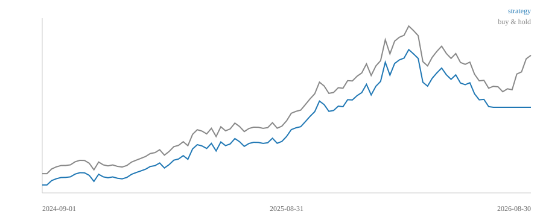

# Macroscope Backtest Report — VRT

**Generated:** 2026-08-25 16:32 UTC · **Data:** 1255 daily bars · **T-012 filter:** active (point-in-time, quarantine, survivorship)

## Verdict

**HOLD** — Mixed: positive or negative but no decisive edge vs the baseline — hold current positioning.

* Edge vs buy & hold: **-73.08%**
* Strategy total return (net, 10bps/side): **+159.02%**
* Buy & hold total return: **+232.10%**

## Performance vs buy & hold baseline

| Metric | Strategy (Regime-aware (T-015)) | Buy & Hold |
|---|---|---|
| Total return (net) | +159.02% | +232.10% |
| CAGR | +61.40% | +82.89% |
| Sharpe (0% rf) | 1.09 | 1.24 |
| Sortino | 1.32 | 1.61 |
| Max drawdown | -44.86% | -61.28% |
| Annual vol | 60.67% | 67.14% |
| Exposure | 87% | 100% |
| Trades | 2 | 0 |
| Cost drag (10bps/side) | 0.20% | 0.00% |

## Baselines (same window, same costs)

| Strategy | Net total return | Sharpe | Max DD |
|---|---|---|---|
| **Buy & hold** | +232.10% | 1.24 | -61.28% |
| Random frequency (seed 42) | +159.02% | 1.09 | -44.86% |
| **Regime-aware (T-015)** | +150.25% | 1.03 | -61.28% |

> Random-frequency is the sanity floor: a strategy that cannot beat a seeded
> coin flip on the same dates and costs is not adding value. Buy & hold is
> THE reference line per @user's requirement.

## Monte Carlo (T-014) — confidence intervals

Bootstrap-resampled 1000 paths of the primary strategy's own daily net
returns (seed 42, 21-day block bootstrap: blocks preserve monthly serial
correlation, so the resampled paths stay representative of the real regime
sequence).

| Metric | P10 | P50 | P90 | Point est. (mean of paths) |
|---|---|---|---|---|
| Total return | +16.6% | +187.7% | +638.1% | +282.4% |
| CAGR | +47.51% | +97.69% | +191.35% | +111.27% |
| Sharpe | 0.45 | 1.21 | 2.00 | 1.22 |
| Max drawdown | -96.5% | -91.0% | -78.5% | -88.8% |

> P10/P50/P90 span the 10th–90th percentile across paths; point estimate is the
> mean of each distribution. A strategy that only wins in the P90 tail (not the
> median) is a lucky path, not an edge — @user's robustness requirement.
> Path drawdowns run deeper than the realized one by construction: the block
> bootstrap preserves monthly correlation but re-orders months, so a dip can
> land on a higher equity base. Read the Sharpe/return columns as the
> robustness signal; treat drawdown percentiles as an upper-bound, not a
> forecast.

## Walk-forward split

* Train window: 2021-08-25 → 2024-08-25 (3y)
* Test window: 2024-08-25 → 2026-08-25 (2y)
* Execution: signal at close(t) → position held for bar t+1 (one-bar lag).
  No same-bar fill, no lookahead by construction (T-012).

## Equity curve

## Integrity

* All metrics computed only on T-012-clean data (the engine's provider owns
  the no-lookahead cut; the cheat-detector suite in tests/test_backtest.py
  proves injected future rows are never visible).
* Cost model: 10 bps per side on turnover (design-doc §14 range 5–15).
* Time is never shuffled; walk-forward rolls yearly without overlap.
